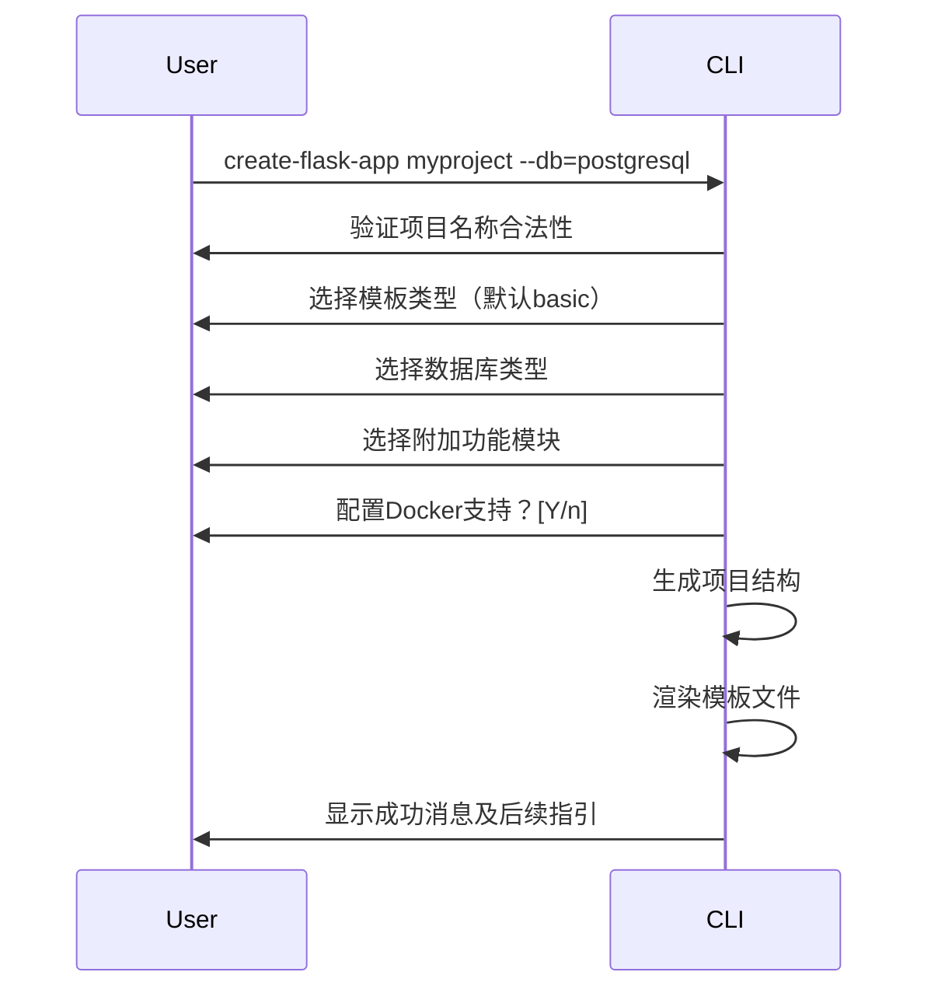

### create-flask-app 设计文档

---

#### 1. 项目目标
开发一个命令行工具，快速生成标准化Flask应用脚手架，集成常用功能模块、开发工具及最佳实践配置，降低项目初始化成本。

---

#### 2. 核心功能

**2.1 基础项目结构生成**
- 默认生成符合Flask官方建议的目录结构：
  ```
  <project_name>/
    app/
      __init__.py
      routes.py
      models/
      templates/
      static/
      config/
        __init__.py
        development.py
        production.py
        testing.py
    tests/
      conftest.py
      test_basic.py
    requirements/
      dev.txt
      prod.txt
    .env
    .gitignore
    README.md
    wsgi.py
  ```

**2.2 交互式配置**
- 支持命令行参数与交互式问答：
  ```bash
  create-flask-app myproject --template=basic --db=postgresql
  ```
  - 关键配置项：
    - 项目名称（Python包命名规范校验）
    - 模板选择（basic/minimal/api/advanced）
    - 数据库类型（None/SQLite/PostgreSQL/MySQL）
    - 启用扩展模块（REST API、用户认证等）
    - 前端集成选项（Webpack/Simple HTML）

**2.3 扩展模块集成**
- 可选功能模块：
  | 模块名称        | 包含组件                          |
  |-----------------|-----------------------------------|
  | Database        | Flask-SQLAlchemy + Alembic迁移    |
  | REST API        | Flask-RESTx + Swagger文档支持      |
  | Authentication  | Flask-Login + JWT支持             |
  | Forms           | Flask-WTF + CSRF保护              |
  | Admin           | Flask-Admin界面                   |

**2.4 开发环境配置**
- 预置开发工具链：
  - 测试框架：pytest + 示例测试用例
  - 代码质量：.editorconfig + pre-commit配置（black/flake8/isort）
  - 调试工具：Debug Toolbar + 热重载配置
  - 环境管理：python-dotenv + 多环境配置加载

**2.5 部署就绪配置**
- 生产环境准备：
  - Gunicorn/Waitress启动脚本
  - Nginx示例配置片段
  - Dockerfile + docker-compose.yml（可选生成）
  - 安全头设置（CORS/HTTPS等）

---

#### 3. 技术架构

**3.1 模板引擎**
- 使用Jinja2渲染模板文件，支持条件化代码生成
- 模板目录按功能模块分块，动态组合

**3.2 配置系统**
- 分层配置设计：
  ```python
  # config/__init__.py
  class Config:
      SECRET_KEY = os.getenv('SECRET_KEY')
      SQLALCHEMY_TRACK_MODIFICATIONS = False

  class DevelopmentConfig(Config):
      DEBUG = True
      SQLALCHEMY_DATABASE_URI = os.getenv('DEV_DATABASE_URL')
  ```

**3.3 依赖管理**
- 生成requirements.txt或pyproject.toml（可选）
- 区分开发/生产依赖：
  ```
  # requirements/dev.txt
  -r base.txt
  pytest==7.4.0
  python-dotenv==1.0.0
  ```

---

#### 4. 交互流程设计



---

#### 5. 非功能需求

**5.1 可维护性**
- 模块化模板设计，便于后续功能扩展
- 版本兼容性：支持Flask 2.x+系列

**5.2 安全性**
- 自动生成随机SECRET_KEY（仅开发环境）
- 生产配置强制要求环境变量获取敏感信息

**5.3 跨平台支持**
- 兼容Windows/macOS/Linux系统
- 处理路径分隔符差异
- 生成可执行的启动脚本（Unix/Windows双版本）

---

#### 6. 文档体系

**6.1 生成项目文档**
- README.md包含：
  - 项目启动指南
  - 环境配置说明
  - 部署流程
  - 扩展模块使用文档

**6.2 工具使用文档**
- 在线文档网站包含：
  - 安装说明：`pip install create-flask-app`
  - 命令行参数手册
  - 常见问题排错指南
  - 自定义模板开发指南

---

#### 7. 测试策略

**7.1 工具自身测试**
- 单元测试覆盖核心逻辑
- 快照测试验证生成的脚手架结构
- E2E测试完整生成流程

**7.2 生成项目验证**
- 内置示例应用的冒烟测试
- 数据库迁移测试
- REST API端点健康检查

---


